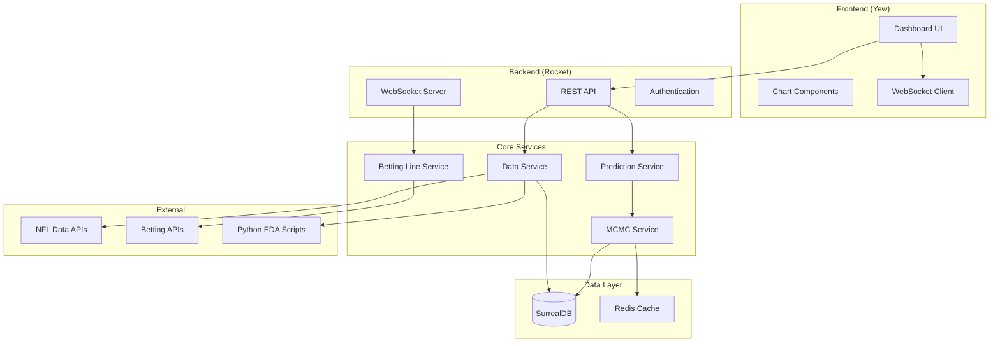

# Design Document

## Overview

The NFL Prediction Dashboard is a full-stack Rust application that combines statistical analysis using Markov Chain Monte Carlo (MCMC) methods with real-time data visualization. The system architecture leverages the existing Rocket backend and Yew frontend, extending them with specialized modules for NFL data processing, MCMC analysis, and betting line comparison.

The system follows a microservices-inspired modular architecture within the monorepo, with clear separation between data ingestion, statistical analysis, and presentation layers. Python integration is handled through a subprocess interface for exploratory data analysis, with results fed back into the Rust ecosystem.

## Architecture

### High-Level Architecture



### Component Architecture

The system is organized into distinct modules within the Rust workspace:

1. **Shared Models Module**: Provides common data structures for frontend and backend
2. **Data Ingestion Module**: Handles NFL data retrieval and normalization
3. **MCMC Analysis Module**: Implements statistical modeling and prediction
4. **Betting Line Module**: Manages betting line data and comparison logic
5. **Dashboard Module**: Provides real-time updates and visualization
6. **Python Integration Module**: Manages EDA script execution and result integration
7. **Administrative Interface Module**: Handles manual game management and admin functions
8. **Database Migration Module**: Manages schema versioning and migration execution

## Components and Interfaces

### Backend Components

#### Data Service (`backend/src/services/data_service.rs`)
```rust
pub struct DataService {
    db: Arc<Surreal<Client>>,
    http_client: reqwest::Client,
    python_executor: PythonExecutor,
}

impl DataService {
    pub async fn fetch_nfl_schedule(&self) -> Result<Vec<Game>, DataError>;
    pub async fn fetch_team_stats(&self, team_id: &str) -> Result<TeamStats, DataError>;
    pub async fn store_game_data(&self, games: Vec<Game>) -> Result<(), DataError>;
    pub async fn run_python_eda(&self, data_path: &str) -> Result<EdaResults, DataError>;
}
```

#### MCMC Service (`backend/src/services/mcmc_service.rs`)
```rust
pub struct McmcService {
    sampler: McmcSampler,
    cache: Arc<dyn CacheProvider>,
}

impl McmcService {
    pub async fn analyze_game(&self, game: &Game, historical_data: &[Game]) -> Result<GamePrediction, McmcError>;
    pub async fn generate_probability_distribution(&self, params: &GameParams) -> Result<ProbabilityDistribution, McmcError>;
    pub fn run_parallel_analysis(&self, games: Vec<Game>) -> Result<Vec<GamePrediction>, McmcError>;
}
```

#### Betting Line Service (`backend/src/services/betting_service.rs`)
```rust
pub struct BettingService {
    providers: Vec<Box<dyn BettingProvider>>,
    db: Arc<Surreal<Client>>,
}

impl BettingService {
    pub async fn fetch_current_lines(&self, game_id: &str) -> Result<Vec<BettingLine>, BettingError>;
    pub async fn compare_with_prediction(&self, line: &BettingLine, prediction: &GamePrediction) -> Result<LineComparison, BettingError>;
    pub async fn identify_value_opportunities(&self, comparisons: Vec<LineComparison>) -> Result<Vec<ValueOpportunity>, BettingError>;
}
```

#### WebSocket Handler (`backend/src/websocket/mod.rs`)
```rust
pub struct DashboardWebSocket {
    connections: Arc<Mutex<HashMap<Uuid, WebSocketConnection>>>,
    prediction_service: Arc<PredictionService>,
}

impl DashboardWebSocket {
    pub async fn broadcast_prediction_update(&self, prediction: GamePrediction);
    pub async fn broadcast_line_update(&self, line_update: LineUpdate);
    pub fn handle_client_subscription(&self, client_id: Uuid, subscription: Subscription);
}
```

#### Administrative Service (`backend/src/services/admin_service.rs`)
```rust
pub struct AdminService {
    db: Arc<Surreal<Client>>,
    auth_service: Arc<AuthService>,
}

impl AdminService {
    pub async fn create_manual_game(&self, admin_id: &str, game_data: ManualGameData) -> Result<Game, AdminError>;
    pub async fn update_manual_game(&self, admin_id: &str, game_id: &str, updates: GameUpdates) -> Result<Game, AdminError>;
    pub async fn delete_manual_game(&self, admin_id: &str, game_id: &str) -> Result<(), AdminError>;
    pub async fn list_manual_games(&self, admin_id: &str) -> Result<Vec<Game>, AdminError>;
    pub async fn resolve_game_conflicts(&self, conflicts: Vec<GameConflict>) -> Result<Vec<Game>, AdminError>;
}
```

#### Migration Service (`backend/src/services/migration_service.rs`)
```rust
pub struct MigrationService {
    db: Arc<Surreal<Client>>,
    migration_runner: surrealdb_migrations::MigrationRunner,
}

impl MigrationService {
    pub async fn run_pending_migrations(&self) -> Result<Vec<MigrationResult>, MigrationError>;
    pub async fn rollback_migration(&self, version: &str) -> Result<(), MigrationError>;
    pub async fn get_migration_status(&self) -> Result<MigrationStatus, MigrationError>;
    pub async fn validate_schema_integrity(&self) -> Result<SchemaValidation, MigrationError>;
}
```

### Frontend Components

#### Dashboard Component (`frontend/src/components/dashboard.rs`)
```rust
#[derive(Properties, PartialEq)]
pub struct DashboardProps {
    pub games: Vec<GameWithPrediction>,
    pub on_game_select: Callback<String>,
}

#[function_component(Dashboard)]
pub fn dashboard(props: &DashboardProps) -> Html {
    // Real-time dashboard implementation
}
```

#### Game Card Component (`frontend/src/components/game_card.rs`)
```rust
#[derive(Properties, PartialEq)]
pub struct GameCardProps {
    pub game: GameWithPrediction,
    pub betting_lines: Vec<BettingLine>,
    pub value_opportunities: Vec<ValueOpportunity>,
}
```

#### Chart Components (`frontend/src/components/charts/`)
- `ProbabilityChart`: Displays MCMC probability distributions
- `TrendChart`: Shows historical team performance trends
- `ComparisonChart`: Visualizes betting line vs prediction comparisons

#### Administrative Components (`frontend/src/components/admin/`)
```rust
#[derive(Properties, PartialEq)]
pub struct AdminPanelProps {
    pub user_role: UserRole,
    pub on_game_create: Callback<ManualGameData>,
    pub on_game_update: Callback<(String, GameUpdates)>,
}

#[function_component(AdminPanel)]
pub fn admin_panel(props: &AdminPanelProps) -> Html {
    // Administrative interface for manual game management
}

#[function_component(ManualGameForm)]
pub fn manual_game_form() -> Html {
    // Form for creating/editing manual games
}
```

#### Mock Data Components (`frontend/src/components/mock/`)
```rust
#[derive(Properties, PartialEq)]
pub struct MockDataFormProps {
    pub on_submit: Callback<MockGameData>,
    pub validation_errors: Vec<ValidationError>,
}

#[function_component(MockDataForm)]
pub fn mock_data_form(props: &MockDataFormProps) -> Html {
    // Development interface for testing with mock data
}
```

## Data Models

### Shared Data Models (`share/src/models/`)

The shared models workspace provides consistent data structures across frontend and backend:

```rust
#[derive(Serialize, Deserialize, Clone)]
pub struct Game {
    pub id: String,
    pub home_team: Team,
    pub away_team: Team,
    pub game_time: DateTime<Utc>,
    pub week: u8,
    pub season: u16,
    pub status: GameStatus,
    pub source: GameSource, // API, Manual, Mock
    pub created_by: Option<String>, // Admin ID for manual games
}

#[derive(Serialize, Deserialize, Clone)]
pub struct Team {
    pub id: String,
    pub name: String,
    pub abbreviation: String,
    pub stats: TeamStats,
}

#[derive(Serialize, Deserialize, Clone)]
pub struct TeamStats {
    pub offensive_rating: f64,
    pub defensive_rating: f64,
    pub recent_form: Vec<GameResult>,
    pub injury_report: Vec<PlayerInjury>,
}
```

### MCMC Analysis Models
```rust
#[derive(Serialize, Deserialize, Clone)]
pub struct GamePrediction {
    pub game_id: String,
    pub home_score_distribution: ProbabilityDistribution,
    pub away_score_distribution: ProbabilityDistribution,
    pub spread_prediction: f64,
    pub total_prediction: f64,
    pub confidence_interval: ConfidenceInterval,
    pub generated_at: DateTime<Utc>,
}

#[derive(Serialize, Deserialize, Clone)]
pub struct ProbabilityDistribution {
    pub mean: f64,
    pub std_dev: f64,
    pub samples: Vec<f64>,
    pub percentiles: HashMap<u8, f64>,
}

#[derive(Serialize, Deserialize, Clone)]
pub struct McmcParameters {
    pub num_samples: usize,
    pub burn_in: usize,
    pub chains: usize,
    pub convergence_threshold: f64,
}
```

### Betting Line Models
```rust
#[derive(Serialize, Deserialize, Clone)]
pub struct BettingLine {
    pub id: String,
    pub game_id: String,
    pub provider: String,
    pub spread: f64,
    pub total: f64,
    pub moneyline_home: i32,
    pub moneyline_away: i32,
    pub timestamp: DateTime<Utc>,
}

#[derive(Serialize, Deserialize, Clone)]
pub struct LineComparison {
    pub game_id: String,
    pub betting_line: BettingLine,
    pub prediction: GamePrediction,
    pub spread_difference: f64,
    pub total_difference: f64,
    pub value_score: f64,
}

#[derive(Serialize, Deserialize, Clone)]
pub struct ValueOpportunity {
    pub game_id: String,
    pub opportunity_type: OpportunityType,
    pub confidence: f64,
    pub expected_value: f64,
    pub recommendation: String,
}

#[derive(Serialize, Deserialize, Clone)]
pub enum GameSource {
    Api,      // Retrieved from external NFL API
    Manual,   // Created by administrator
    Mock,     // Test data for development
}

#[derive(Serialize, Deserialize, Clone)]
pub struct ManualGameData {
    pub home_team_id: String,
    pub away_team_id: String,
    pub game_time: DateTime<Utc>,
    pub week: u8,
    pub season: u16,
    pub venue: Option<String>,
    pub notes: Option<String>,
}

#[derive(Serialize, Deserialize, Clone)]
pub struct MockGameData {
    pub game: Game,
    pub prediction: Option<GamePrediction>,
    pub betting_lines: Vec<BettingLine>,
    pub is_test_data: bool,
}
```

## Error Handling

### Error Types
```rust
#[derive(Debug, thiserror::Error)]
pub enum AppError {
    #[error("Data retrieval error: {0}")]
    DataError(#[from] DataError),
    
    #[error("MCMC analysis error: {0}")]
    McmcError(#[from] McmcError),
    
    #[error("Betting service error: {0}")]
    BettingError(#[from] BettingError),
    
    #[error("Database error: {0}")]
    DatabaseError(#[from] surrealdb::Error),
    
    #[error("Python integration error: {0}")]
    PythonError(String),
}
```

### Error Recovery Strategies
1. **Data Retrieval Failures**: Fall back to cached data with staleness indicators
2. **MCMC Convergence Issues**: Retry with adjusted parameters, provide uncertainty bounds
3. **Betting Line Unavailability**: Display predictions without comparison, mark as incomplete
4. **Python Integration Failures**: Continue with Rust-only analysis, log for manual review

## Testing Strategy

### Unit Testing
- **MCMC Service**: Test convergence, parameter sensitivity, and statistical validity
- **Data Service**: Mock external APIs, test data transformation and validation
- **Betting Service**: Test line comparison logic and value calculation algorithms
- **Frontend Components**: Test rendering, user interactions, and WebSocket handling

### Integration Testing
- **End-to-End Prediction Pipeline**: From data ingestion through MCMC analysis to dashboard display
- **Real-time Updates**: Test WebSocket communication and state synchronization
- **Python Integration**: Test subprocess execution and result parsing
- **Database Operations**: Test data persistence and retrieval under load

### Performance Testing
- **MCMC Analysis Speed**: Benchmark analysis time for single games and batch processing
- **Concurrent User Load**: Test dashboard performance with multiple simultaneous users
- **Memory Usage**: Monitor memory consumption during large dataset processing
- **WebSocket Scalability**: Test real-time update performance with many connected clients

### Statistical Validation
- **MCMC Convergence**: Implement Gelman-Rubin diagnostic and effective sample size checks
- **Prediction Accuracy**: Backtest predictions against historical game outcomes
- **Calibration Testing**: Verify that confidence intervals contain actual outcomes at expected rates
- **Cross-validation**: Test model performance on held-out data sets

## Implementation Dependencies

### New Rust Crates Required
```toml
# Backend additions
mcmc = "0.3"  # Or custom MCMC implementation
statrs = "0.16"  # Statistical functions
plotters = "0.3"  # Chart generation for Python integration
reqwest = { version = "0.11", features = ["json"] }
redis = "0.23"  # Caching layer
uuid = { version = "1.0", features = ["v4"] }
chrono = { version = "0.4", features = ["serde"] }

# Frontend additions
plotly = "0.8"  # Interactive charts
gloo-timers = "0.2"  # WebSocket reconnection
web-sys = "0.3"  # Browser APIs
```

### Python Environment
- **NumPy/SciPy**: Advanced statistical computations
- **Pandas**: Data manipulation for EDA
- **Matplotlib/Seaborn**: Visualization for analysis validation
- **PyMC**: Alternative MCMC implementation for comparison
- **Scikit-learn**: Feature engineering and model validation

### External APIs
- **NFL API**: Official or ESPN API for game data
- **Betting APIs**: DraftKings, FanDuel, or odds aggregation services
- **Rate Limiting**: Implement respectful API usage patterns

This design provides a robust foundation for implementing the NFL prediction dashboard while maintaining the existing Rust-centric architecture and incorporating the requested MCMC statistical analysis capabilities.